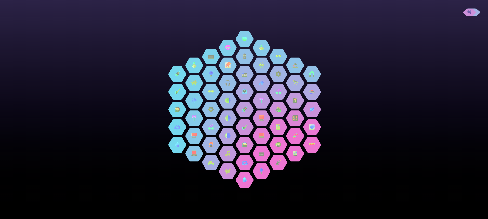
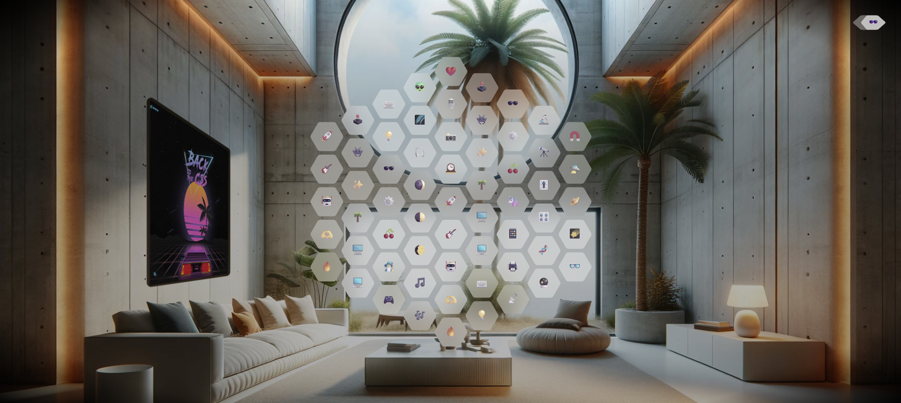

<div align="center">

</div>

<div align="center">

</div>

# 🔷 Hexagon Grid Ripple Effect

An interactive and visually immersive web experience that combines a
futuristic hexagonal grid with dynamic ripple animations. The project
demonstrates how simple geometric patterns and smooth animations can
create engaging user experiences using only HTML, CSS, and JavaScript.

------------------------------------------------------------------------

## ✨ Features

-   🔷 Interactive hexagonal grid layout
-   🌊 Dynamic ripple animations
-   🖱️ Mouse-responsive interactions
-   ⚡ Smooth and optimized animations
-   🎨 Modern sci-fi inspired design
-   📱 Responsive layout
-   🚀 Lightweight and fast performance
-   💡 Clean and maintainable code structure

------------------------------------------------------------------------

## 📸 Preview

Experience a mesmerizing ripple effect that travels across a grid of
hexagonal cells, creating an engaging and futuristic visual experience.

------------------------------------------------------------------------

## 🚀 Live Demo

https://binaryvortex.github.io/Hexagon-Grid-Ripple-Effect/

------------------------------------------------------------------------

## 🛠️ Tech Stack

-   HTML5
-   CSS3
-   JavaScript
-   CSS Animations
-   DOM Manipulation

------------------------------------------------------------------------

## 📂 Project Structure

    Hexagon-Grid-Ripple-Effect/
    │
    ├── index.html
    ├── style.css
    ├── script.js
    └── README.md

------------------------------------------------------------------------

## 💡 About the Project

The Hexagon Grid Ripple Effect project was built to explore creative
coding techniques, animation timing, and interactive user experiences.

By combining mathematical patterns with smooth animations, this project
demonstrates how modern web technologies can be used to create visually
engaging experiences without relying on external libraries.

------------------------------------------------------------------------

## ⚙️ Installation

Clone the repository:

``` bash
git clone https://github.com/BinaryVortex/Hexagon-Grid-Ripple-Effect.git
```

Navigate to the project folder:

``` bash
cd Hexagon-Grid-Ripple-Effect
```

Open the project:

``` bash
Open index.html in your browser
```

------------------------------------------------------------------------

## 🎯 Learning Outcomes

-   Working with geometric layouts
-   Creating animation effects with CSS
-   Handling interactions with JavaScript
-   Building visually engaging user interfaces
-   Improving frontend performance techniques

------------------------------------------------------------------------

## 🔮 Future Improvements

-   Additional animation modes
-   Multiple color themes
-   Adjustable ripple speed
-   Mobile gesture interactions
-   Customizable grid sizes

------------------------------------------------------------------------

## 👨‍💻 Author

**Disandu Perera**

Passionate about frontend development, creative coding, UI/UX design,
and interactive web experiences.

------------------------------------------------------------------------

## ⭐ Support

If you enjoyed this project, consider giving it a star and sharing your
feedback.

------------------------------------------------------------------------

Made with ❤️ using HTML, CSS, and JavaScript.
